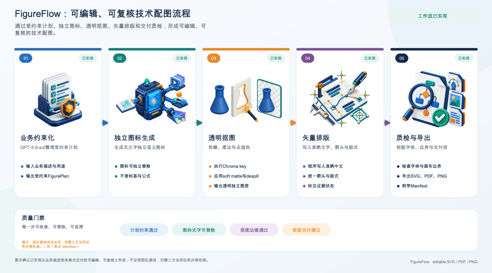
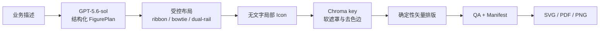

# FigureFlow

> 把“一段业务描述”转成语义可审查、文字准确、可继续编辑的流程图。

本仓库是独立的答辩 Demo，与其他同名开源项目或商业产品无关联；发布包名使用 `figureflow-demo`，不占用通用的 `figureflow` 名称。

FigureFlow 是一个面向技术汇报、SOP、论文与专利配图的 AI 辅助绘图 Demo。它不让生图模型一次性“猜”完整张图，而是把任务拆成可检查的四层：

1. `gpt-5.6-sol` 将需求整理成受约束的 `FigurePlan`；
2. 生成式视觉能力只负责无文字、可替换的局部图标；
3. 确定性程序完成中文、连线、版式和导出；
4. QA 和 manifest 记录证据状态、产物与耗时。

这个设计的核心是：**AI 负责语义和创意，确定性渲染器负责精确内容。**



[播放 72 秒真实在线操作 Demo（中文语音与字幕）](demo/figureflow-demo.mp4) · [查看局部替换证明](examples/live_gpt56/local_edit_proof.png) · [查看旁白与现场讲解稿](demo/video_script.md) · [查看可编辑 SVG](examples/live_gpt56/figureflow_live.svg) · [查看结构化计划](examples/live_gpt56/figure_plan.json) · [查看脱敏 Manifest](examples/live_gpt56/run_manifest.json)

上图来自一次真实 `gpt-5.6-sol` 语义规划与一次 `gpt-image-2` 无文字 Icon 生成，随后执行透明抠图、三布局渲染和自动 QA。公开样例不保留实际服务路由、响应标识、token 数、原始提示词或绝对路径。运行耗时只是该机器上的单次流水线记录，不是团队提效结论；可复现的固定离线样例仍保留在 [`examples/`](examples/README.md)。

## 要解决的问题

团队日常绘图常见两条路径：

- **文档内手工“拉电线”**：在企业微信、飞书等文档工具中逐个创建形状、对齐、连线和调整。它可控，但重复操作多，改一个节点经常会牵动整张图。
- **整图生成 + 二次局部编辑**：先用全图生成工具（如 Nano Banana 类工具）获得视觉稿，再反复修改文字、箭头或局部元素。它出稿快，但精确文字、公式、关系与非目标区域的稳定性难以保证。

FigureFlow 适合于“语义判断很重要，但输出又必须精确可改”的任务。当前仓库是可演示原型，不声称已替代专业制图软件，也不声称已在团队规模完成提效验证。

## 工作流



模型不返回可执行代码，只能从白名单布局、主题和素材键中构造经 Pydantic 校验的计划。标签、流程关系和证据状态由程序渲染，不依赖生图模型的文字能力。

## 两种可明确区分的演示模式

| 模式 | 语义规划 | 适合场景 | 可核验记录 |
|---|---|---|---|
| `offline` | 读取仓库内的固定预设 | 无网络、无 API Key 或需要稳定录屏 | 离线回放 / 合成演示 |
| `online` | 通过 OpenAI Responses API 实时调用 `gpt-5.6-sol` | 展示从新需求到新计划的完整路径 | 页面状态，以及 manifest 中的模型、响应 ID 和 token 用量 |
| `auto` | 有 Key 时尝试在线；无 Key 或在线失败时显式回退 | 本地体验 | 回退原因，不伪装成在线结果 |

`offline` 展示的是同一条素材处理、排版、QA 和导出链路，但它**不是一次实时 GPT-5.6-sol 调用**。`online` 模式缺少 Key 时会报错，不会悄悄替换成其他模型。

默认使用仓库内已准备的无文字演示 Icon。在线时可勾选“额外实时生成 1 个 Icon”，这会由 `gpt-5.6-sol` 通过 Responses API 调用图像工具，默认图像模型为 `gpt-image-2`。该选项会增加等待时间和 API 费用；其余 Icon 仍使用本地可复现素材。

仓库额外包含 `gpu_server` 与 `robot_inspection` 两个无文字色键案例：它们由内置 ImageGen 工作流生成，并在每次使用时继续走同一套 chroma soft-matte → RGBA → 排版链路。真实参考来源、作者和许可证角色记录在 [`assets/icons/provenance.json`](assets/icons/provenance.json)；生成图仍标注为 `synthetic-demo`，不会冒充参考照片或官方品牌素材。

## 可体验的主题、投屏字号与真实参考

界面现在把三个原先隐含的设计选择显式化，并将其写入 `FigurePlan`、renderer manifest 与 QA：

- `academic-audit`：默认论文/汇报配色；
- `gpu-green-tech`：以高对比绿色为主强调色的通用 GPU Systems 技术配色，不使用第三方 Logo，也不暗示背书、授权或关联；
- `standard`：保持原有兼容版式；
- `presentation-spacious`：stage 标题、副标题、正文和 gate 字号相对标准档提高约 25%，每个 stage 最多两条正文，并在三种布局上记录可机读的 `layout_qa`。

参考图入口是 metadata-only：检索结果可在页面中查看标题、来源页、作者和许可证，然后作为 `reference_assets` 写入计划与清单，但不会自动下载或放进画布。

| Provider | 默认联网 | 行为与边界 |
|---|---:|---|
| `offline-example` | 否 | 返回仓库内的可移植合成示例 URI，适合复现与录屏 |
| `user-url` | 否 | 只校验和记录用户 URL；查询串与片段会被丢弃，服务端绝不抓取、预览或跟随该 URL |
| `wikimedia-commons` | 是 | 只调用固定的 Commons MediaWiki API；仅保留 JPEG/PNG/WebP 且同时具有来源页与许可证的结果 |

命令行可独立验证 provider：

```bash
python -m demo_core.reference_search "GPU cluster data centre" --provider wikimedia-commons --limit 3
python -m demo_core.reference_search --provider user-url --url "https://example.org/reference.png"
```

也可以把结果直接送入流水线：

```python
from demo_core.pipeline import run_pipeline
from demo_core.reference_search import search_references

references = search_references("GPU cluster", provider="wikimedia-commons", limit=3)
result = run_pipeline(
    "把 GPU 集群告警处理流程画成投屏图",
    mode="offline",
    theme_override="gpu-green-tech",
    layout_preset_override="presentation-spacious",
    reference_assets=references,
)
```

这里的“搜索”只提供构图参考与溯源，不证明素材可直接商用。交付前仍需人工确认许可证、署名、商标与组织内部合规要求。

## 快速开始

建议使用 Python 3.10–3.12。首次启动：

```bash
python3 -m venv .venv
source .venv/bin/activate
python -m pip install --upgrade pip
python -m pip install -r requirements.txt
python app.py
```

打开终端中显示的本地地址，在界面中选择模式并提交需求。不配置 Key 也可以使用离线回放。

启用真实在线规划前，在**服务器环境**设置：

```bash
export OPENAI_API_KEY="your-api-key"
export OPENAI_MODEL="gpt-5.6-sol"
export OPENAI_IMAGE_MODEL="gpt-image-2"
export DEMO_MODE="online"
python app.py
```

API Key 不需要、也不应输入浏览器。`.env.example` 仅是配置模板；请使用你的运行环境或密钥管理服务注入变量，不要提交 `.env`。

### Docker

```bash
docker build -t figureflow .
docker run --rm -p 7860:7860 -e DEMO_MODE=offline figureflow
```

在线模式应通过部署平台的 secret 功能提供 `OPENAI_API_KEY`，不要写入镜像或 Dockerfile。

若要把 Link 暴露到公网，推荐先启用只读合成演示模式：

```bash
docker run --rm -p 7860:7860 \
  -e FIGUREFLOW_PUBLIC_DEMO=true \
  -e FIGUREFLOW_MAX_RUNS=8 \
  figureflow
```

该模式会锁定仓库内的合成示例、强制离线复演并禁用实时 Icon，因此不会把访客输入发送给模型或产生 API 费用。若确需公网展示在线能力，应同时配置 `FIGUREFLOW_BASIC_AUTH_USER` / `FIGUREFLOW_BASIC_AUTH_PASSWORD`，并在反向代理设置 TLS、请求速率和费用预算。应用队列默认只并发执行 1 个任务、最多等待 8 个任务；运行目录默认只保留最近 8 次。

## 输出与可检查性

每次运行在独立目录中保存中间产物和最终交付，典型包括：

- 结构化 `FigurePlan` 与规划元数据；
- 原始图标、透明抠图与处理参数；
- 可继续编辑的 SVG、矢量 PDF 和预览 PNG；
- QA 结果、阶段耗时、文件哈希和证据状态；
- 便于下载和复现的打包产物。

预设图明确标注为 `synthetic-demo`。只有经过实际对照实验获得的数字，才应当标注为 `measured`。

## 如何量化提效

本仓库不预置“提效 80%”或“10 倍更快”之类未实测结论。推荐使用同一份输入与验收清单，对照三种方法：

1. 企业微信 / 飞书文档内手工绘制；
2. 整图生成 + 二次局部编辑；
3. FigureFlow 混合工作流。

最小可行实验是 3 个任务 × 3 种方法；更可靠的设计是 3 名参与者 × 3 个任务 × 3 种方法，并随机化方法顺序。任务建议覆盖：汇报流程图、SOP 流程图、论文或专利框架图。

| 指标 | 可复现定义 |
|---|---|
| 首个合格版本耗时 | 从看到任务到首次满足同一验收清单的时间 |
| 主动人工操作时间 | 排除等待后，实际点击、拖拽、输入与修改时间 |
| 局部修改耗时 | 只更改指定节点后，恢复到合格状态的时间 |
| 语义准确率 | 验收清单中正确节点、连线和方向的比例 |
| 文字 / 公式错误 | 错字、丢字、伪文字、公式或单位错误的计数 |
| 版式缺陷 | 重叠、裁切、箭头穿过文字、不可读字号的计数 |
| 非目标稳定性 | 局部修改后，未要求变化的内容保持不变的比例 |
| 可编辑交付率 | 能够不重做整图就继续修改的产物比例 |

对结果报告中位数和四分位距，保留屏幕录制与原始时间戳，并让不知道方法名称的评审按同一清单盲评。如果当前只有 Demo 耗时，应写“流水线运行耗时”，不要把它直接解读为人员提效。

## 仓库结构

```text
FigureFlow/
├── app.py                         # Gradio 体验界面
├── demo_core/                    # 规划、素材处理、渲染与 QA 编排
│   └── reference_search.py       # 可插拔参考检索（默认离线 / 用户 URL 不抓取）
├── presets/                      # 离线回放的结构化预设
├── prompts/                      # 受约束规划提示词
├── assets/icons/                 # 原始和处理后的无文字素材
├── benchmark/                    # 三种方法的实测任务、量表与统计脚本
├── demo/                         # 操作录屏、字幕、答辩讲解稿与本地产物
├── examples/                     # 已脱敏的示例图、计划与单次运行记录
├── skill/design-research-figures # 可独立使用的 Codex skill
├── tests/                        # 回归与隐私检查
└── demo/output/                  # 本地运行产物（默认不提交）
```

## 安全与隐私

- 在线模式会把输入的绘图需求发送给 OpenAI API；请不要在公开部署中输入内网机密、个人信息或未披露数据。
- 离线回放不发起语义规划 API 请求；运行前仍应检查所在环境的网络和日志配置。
- 产物中可能包含用户提交的文字；分享 ZIP、manifest 或录屏前请做脱敏检查。
- 不要把 API Key 放入前端、URL、日志、manifest 或截图。
- `user-url` provider 不发起请求；如果实现新的联网 provider，应固定允许的 API endpoint、限制响应体，并只返回经过 schema 校验的 metadata。

更完整的部署边界和漏洞报告方式见 [SECURITY.md](SECURITY.md)。

## Skill 的独立使用

`skill/design-research-figures/` 保留了研究图表的完整方法、渲染器和 QA 工具。它覆盖数据图、框架图、关系图、结果表和 TikZ 机制图；顶层 Demo 另外提供了面向中文业务流程的窄接口。请从 [skill/design-research-figures/SKILL.md](skill/design-research-figures/SKILL.md) 开始阅读。

## 开发与验证

```bash
python -m pip install -e ".[dev]"
python -m compileall demo_core skill/design-research-figures/scripts
python -m unittest discover -s tests -v
# 安装 dev 依赖后也可以：python -m pytest
```

顶层 Demo 的 PDF 质量检查使用 Poppler 中的 `pdfinfo` 和 `pdffonts`；Docker 镜像已包含它们。完整研究图表模块还可选使用 XeLaTeX/TeX Live 来编译表格和 TikZ 机制图，默认轻量镜像不包含 TeX Live。

## 许可证

本项目代码使用 [MIT License](LICENSE)。直接依赖和容器组件保留各自许可证，详见 [THIRD_PARTY_NOTICES.md](THIRD_PARTY_NOTICES.md)。使用模型或生成资产时，还应遵守相应服务条款与所在组织的数据规范。

---

**English summary:** FigureFlow is a hybrid AI/deterministic pipeline for editable workflow, SOP, paper, and patent figures. GPT-5.6-sol produces a validated semantic plan; generated imagery is limited to text-free local assets; deterministic code owns text, connectors, layout, QA, and SVG/PDF/PNG delivery. Offline replay is visibly distinguished from a live API run, and no efficiency claim is made without a controlled benchmark.
